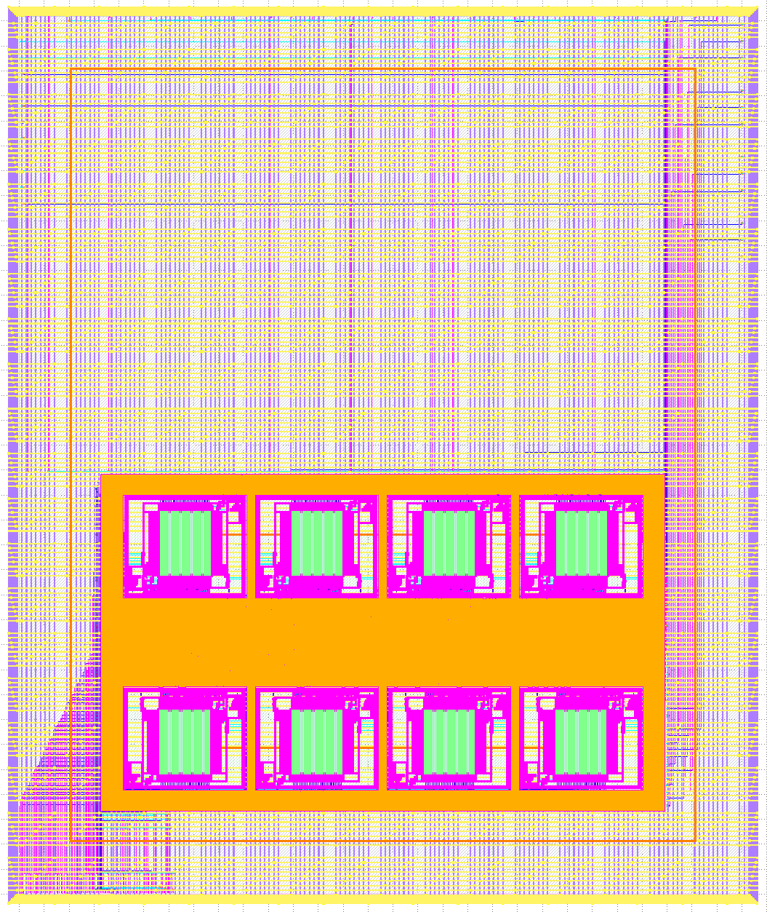

# Caravel PyFive adaptation from MPW-1 to MPW-8

### MPW-1 project
https://platform.efabless.com/projects/12

https://github.com/PyFive-RISC-V/caravel_pyfive

### MPW-8 project
https://platform.efabless.com/projects/1875

### Description

The original goal of the PyFive project is to create a RISC-V based microcontroller with the ability to easily support CircuitPython.

For the first shuttle, we are starting small and verifying the USB core. The USB core is accompanied by simple audio and video output cores to fill in more of the user area.

Future plans are to create a full featured VexRiscV core with SRAMs once the OpenRAM support is released.

### Main changes from the base caravel_user_project repo
- Added pyfive_top repo to /verilog/rtl
- Added the basic openlane files to harden pyfive_top inside caravel (config.tcl, macro_placement.cfg, pin_order.cfg)
- Modified verilog/rtl/user_project_wrapper to include pyfive_top
- Modified openlane/user_project_wrapper/config.json for pyfive_top
- Modified openlane/user_project_wrapper/macro.cfg
- Modified verilog/rtl/user_defines.v to set the power-on configuration of the GPIO
- Modified verilog/includes/includes.rtl.caravel_user_project to add all the pyfive source to run verifications
- Added the pyfive_test1 to the verilog/dv, adapting the test made for MPW-1

### GDS view

---

## More info about Caravel User Project:

Refer to [README](docs/source/index.rst#section-quickstart) for a quickstart of how to use caravel_user_project

Refer to [README](docs/source/index.rst) for this sample project documentation. 
